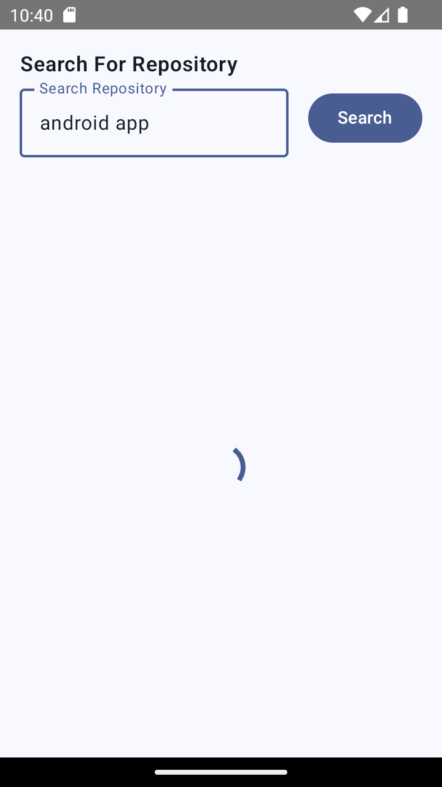

# GitHub Repository Search App

This mobile application is built using the **GitHub API** to search through repositories. The app allows users to search for repositories, view detailed information about a selected repository, and browse through the repositories. The app leverages **Jetpack Compose**, **MVVM**, **Coroutines**, **Room Database**, and the **Repository Pattern** for better architecture and offline support.

## Features

### 1. **Home Screen**:
   - **Search Bar**: Users can search for repositories from GitHub's API.
   - **RecyclerView (CardView)**: Displays the search results in a paginated list, limited to 10 items per page.
   - **Pagination**: Fetches 10 repositories at a time from the API to avoid excessive data usage and improve performance.
   - **Offline Support**: The first 15 items retrieved are saved in a local database (Room). Even when the user is offline, they can view the previously fetched repositories.
   - **Clicking on a Repository**: On selecting an item from the list, the user is navigated to the **Repo Details Screen**.

### 2. **Repo Details Screen**:
   - **Detailed Description**: Displays information about the selected repository such as:
     - Repository name
     - Project link (clickable, opens a web view)
     - Description
     - List of contributors
   - **Contributors**: Clicking on a contributor’s name lists the repositories that are tagged to them.
   - **Web View**: When the project link is clicked, the URL opens in a web view to show the content of the link.

## Architecture and Technologies

The app follows modern Android development best practices:

- **MVVM Architecture**: The app uses the **Model-View-ViewModel** architecture, separating UI logic from business logic.
- **Jetpack Compose**: UI is built using Jetpack Compose for a modern, declarative UI framework.
- **Room Database**: The app saves the first 15 repositories locally using Room, allowing offline access to the data.
- **Coroutines**: For background tasks, API calls, and data processing, **Coroutines** are used.
- **Retrofit**: The GitHub API is accessed using Retrofit for network operations.
- **Repository Pattern**: A repository pattern is used to handle data operations and abstract the logic for the UI to make the app modular and testable.

## ScreenShots
Home Screen

Repo Screen

Web view

